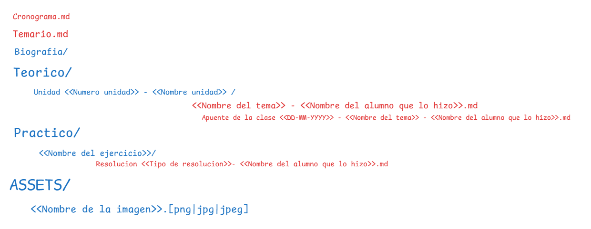

# Matarial ISW
Materia ISW 2025 
Profesores adjuntos:
* 
## Integrantes

| Nombre Completo      | Legajo |
| -------------------- | ------ |
| Lucia Bossio         | 91461  |
| Camila Chavez        | 71805  |
| Daniel Gevara        | 57743  |
| Agustin Li Bongiorno | 94996  |
| Ignacio Loyola       | 94505  |
| Mateo Maldonado      | 98717  |
| Emanuel Rubiolo      | 424360 |
| Matias Sciarra       | 95034  |
| Leonel Truenow       | 93109  |

## Items de configuracion

### Glosario

| Item de configuracion          | Regla de nombrado                                                        | Ubicacion                                        | Descripción |
| ------------------------------ | ------------------------------------------------------------------------ | ------------------------------------------------ | ----------- |
| Cronograma                     | Cronograma.md                                                            | Raiz de proyecto `/`                             | Contiene el cronograma de la materia: prácticos, parciales, trabajos en grupo y el horario de clases. |
| Temario                        | Temario.md                                                               | Raiz de proyecto `/`                             | Unidades de la materia. |
| Apuntes de Teorico             | `Nombre de tema` - `Nombre del alumno que lo hizo`.md                     | Teorico/Unidad `Numero unidad` - `Nombre unidad`/ | Apuntes elaborados sobre la unidad, pero no tomados directamente en clase. |
| Apuntes de clase teorico       | Apunte de la clase `DD-MM-YYYY` - `Nombre del tema` - `Nombre del alumno que lo hizo`.md | Teorico/Unidad `Numero unidad` - `Nombre unidad`/ | Apuntes que se toman en el día de la clase. |
| Resolucion de ejercicio        | Resolucion `Tipo de resolucion` - `Nombre del alumno que lo hizo`.md     | Practico/`Nombre del ejercicio`/                 | Contiene el ejercicio trabajado, con su tipo de resolución y el autor. |
| Imagenes                       | `Nombre de la imagen`.(png/jpg/jpeg)                                     | Assets/                                          | Repositorio de imágenes usadas en apuntes o ejercicios. |

### Estructura del repositorio
```php-template
.
├── Cronograma.md
├── Temario.md
├── Biografia/
├── Teorico/
│   └── Unidad <<Numero unidad>> - <<Nombre unidad>>/
│       ├── <<Nombre del tema>> - <<Nombre del alumno que lo hizo>>.md
│       └── Apunte de la clase <<DD-MM-YYYY>> - <<Nombre del tema>> - <<Nombre del alumno que lo hizo>>.md
├── Practico/
│   └── <<Nombre del ejercicio>>/
│       └── Resolucion <<Tipo de resolucion>> - <<Nombre del alumno que lo hizo>>.md
└── ASSETS/
    └── <<Nombre de la imagen>>.(png|jpg|jpeg)
```

